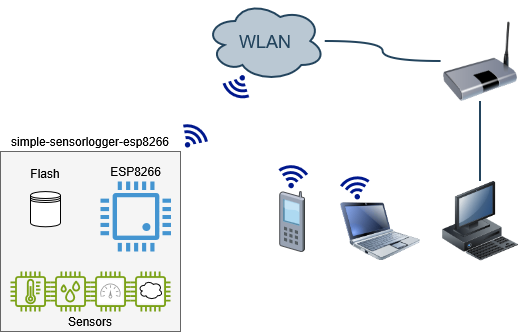
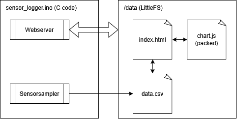
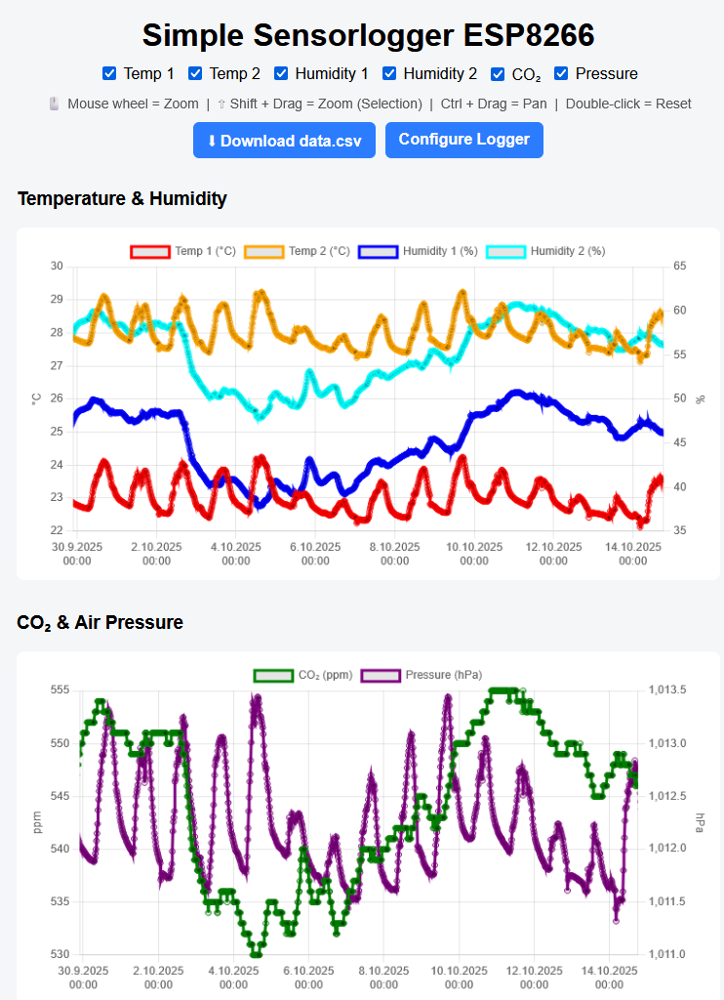
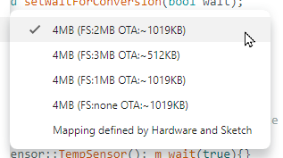

# simple-sensorlogger-esp8266
Logs multiple sensor data into local flash. Data can be accessed and displayed as graph in the WebUI running on the device.

## Overview
The device consists of an ESP8266 with several sensors connected. This device connects to the WLAN and can be accessed with a PC or smart phone or similar devices.

The webserver running on the ESP8266 serves the files directly from the filesystem (LittleFS). All the files are ready to use on the filesystem and no active code has to be executed to show the webpage with the sensor data.

On the other hand the sensor sampler samples all the sensors every configured period and stores the data into data.csv on the LittleFS. This file can than be accessed directly from the webpage.

The webpage showing a chart of the sensordata with enabled pan and zoom. The data can be hidden/shown using the checkboxes on the top. Check the page (here)[https://grafmar.github.io/simple-sensorlogger-esp8266/src/sensor_logger/Uncompressed_data/] in a static version with fake data.

## Installation
To program the ESP8266 for this project you need the following SW and additional libraries and packages:
- Arduino IDE (V2.3.7)
- Libraray WiFi Manager (V2.0.17)
- Board support package `esp8266` by ESP866 Comunity (V3.1.2) providing following libraries:
  - ESP8266WiFi
  - ESP8266WiFiUdp
  - ESP8266WebServer
  - ESP8266mDNS
  - LittleFS
- LittleFS uploader tool (arduino-littlefs-upload)[https://github.com/earlephilhower/arduino-littlefs-upload?tab=readme-ov-file]:
  - Copy the VSIX file to C:\Users\<username>\.arduinoIDE\plugins\ on Windows (you may need to make this directory yourself beforehand). Restart the IDE.

 tool `esp8266littlefs.jar`:
  - from (arduino-esp8266littlefs-plugin)[https://github.com/earlephilhower/arduino-esp8266littlefs-plugin/releases]
  - check (install documentation)[https://randomnerdtutorials.com/install-esp8266-nodemcu-littlefs-arduino/#installing]

Open sensor_logger.ino project connect the Wemos D1 R2 mini via USB. Select the right serial port and select the board `LOLIN(WEMOS) D1 R2 & mini`.

Select the right memory segmentation: Tools -> Flash Size -> `4MB(FS2MB OTA:~1019KB)`

Compile and upload the code to the ESP8266.

To upload the data to the LittleFS you type: `[Ctrl]` + `[Shift]` + `[P]`, then "`Upload LittleFS to Pico/ESP8266/ESP32`". Check that the serial monitor is turned off, otherwise it won't work.

## Acknowledgements
The idea of this project is based on "Examples/16. Data logging/A-Temperature_logger" of the https://github.com/tttapa/ESP8266/tree/master repository. The sensor sampling code and HTML code have been mostly changed and also the chart library has been replaced with chart.js. But that's where the idea and has come from.

Parts of this project were created with the assistance of AI tools
such as ChatGPT and Microsoft Copilot.

## Licence
The project is based on (Examples/16. Data logging/A-Temperature_logger)[https://github.com/tttapa/ESP8266/tree/master] which is licenced under GPL v3 and so is this project.

The Javascript libraries chart.js, hammerjs, chartjs-adapter-date-fns and chartjs-plugin-zoom are licenced under MIT licence. These are concatenated into chart_packed.js and than compressed to chart_packed.js.gz.
